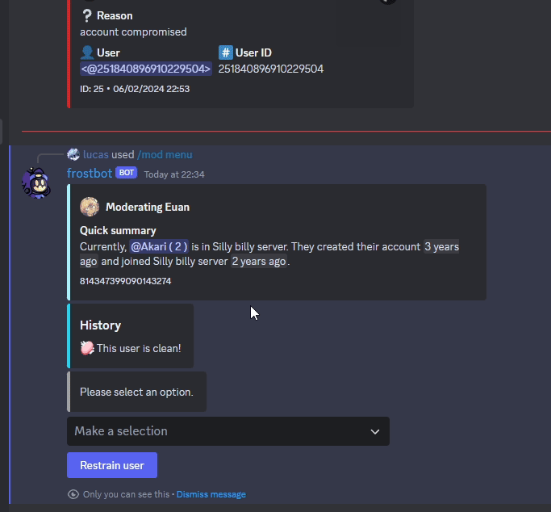
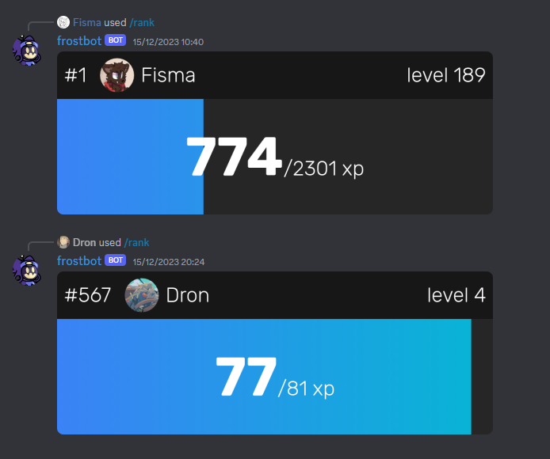

# frostbot

Advanced moderation bot for a now defunct Discord server. Embeds layout and UX
are based off of [shackhorn](https://github.com/shackhorn)'s Goobism V3.

## Known issues

- XP doesn't properly support multiple servers.

## Usage

To get started, set-up an S3-compatible storage bucket and a Postgres database, and push the Drizzle schema to the database using `drizzle-kit`. Next, fill in and rename the `example.config.json` and `example.env` files. Finally, compile the TypeScript code to JavaScript, and run `dist/index.mjs`.

## License

Copyright (C) 2024 Jochem W. \<license (at) jochem (dot) cc>

This program is free software: you can redistribute it and/or modify
it under the terms of the GNU Affero General Public License as
published by the Free Software Foundation, either version 3 of the
License, or (at your option) any later version.

This program is distributed in the hope that it will be useful,
but WITHOUT ANY WARRANTY; without even the implied warranty of
MERCHANTABILITY or FITNESS FOR A PARTICULAR PURPOSE. See the
GNU Affero General Public License for more details.

You should have received a copy of the GNU Affero General Public License
along with this program. If not, see https://www.gnu.org/licenses/.
